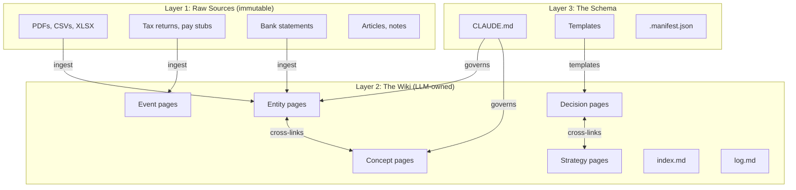
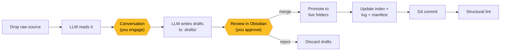
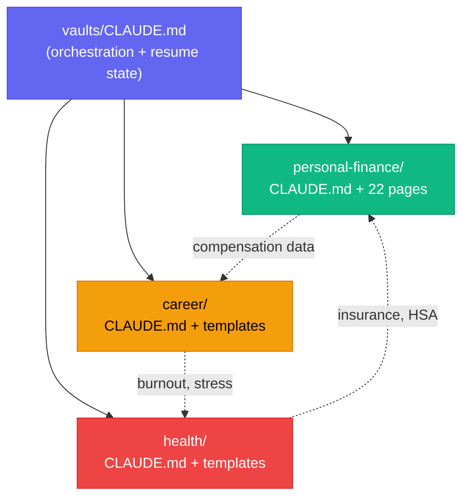

<div align="center">

# brainfreeze

**An enhanced LLM Wiki built on [Karpathy's pattern](https://gist.github.com/karpathy/442a6bf555914893e9891c11519de94f)**

LLMs maintain your personal knowledge base. Obsidian reads it. You stay in the loop.

[](LICENSE)
[](https://github.com/YOUR_USERNAME/brainfreeze/pulls)

</div>

---

brainfreeze extends Karpathy's LLM Wiki with the operational discipline his gist deliberately left out — provenance tracking, review gates, idempotent ingests, typed relationships, and multi-vault support for organizing your whole life, not just one research topic.

His gist describes the philosophy. This repo gives you the schema, templates, and guardrails so you can `git clone` and start ingesting on day one.

---

## Background

I had a multi-agent pipeline for processing personal financial documents — specialist agents (tax, portfolio, data engineering) that maintained their own `learnings.md` notes, ingested raw PDFs and CSVs, and produced structured data for dashboards. Good at crunching numbers. No knowledge layer. The specialist notes were disconnected, cross-references were manual, and you couldn't query the system for reasoning — only for data.

Karpathy's LLM Wiki pattern described exactly the missing piece: a structured wiki that sits on top of raw sources, maintained by an LLM. The specialist notes mapped to wiki pages. The raw documents mapped to his source layer. The processing pipeline mapped to his schema concept. The merge was natural.

Building the actual wiki surfaced failure modes the base pattern doesn't address:

- The provenance system caught a real filing error that a prior LLM session had dismissed — inline citation tracking forced investigation instead of silent acceptance
- Structural lint flagged data gaps that would have gone unnoticed in flat notes
- The manifest system prevented duplicate pages when re-ingesting recurring documents
- Typed relations surfaced a recurring pattern across pages that was invisible in an untyped link graph

The enhancements below came from running a real wiki. They're fixes for specific breakdowns, not theoretical improvements.

---

## Architecture

Three layers, strict separation:



- **Raw sources** are immutable. The LLM reads them but never edits them. Drop files here and forget about them.
- **The wiki** is LLM-owned markdown. The LLM creates pages, updates cross-references, maintains citations. You review and approve.
- **The schema** (`CLAUDE.md` + templates + manifest) tells the LLM *how* to write the wiki. This is where the discipline lives.

---

## The ingest pipeline

This is where brainfreeze diverges most from Karpathy's base pattern. Instead of "LLM reads source, writes pages," there are two mandatory human checkpoints:



The yellow nodes are where you stay in the loop. The LLM never writes to your live wiki without passing through both gates. This is the "[don't delegate understanding](https://stephango.com/)" principle made structural — it's in `CLAUDE.md` as a hard rule, not a suggestion.

---

## What's wrong with the base pattern

I love Karpathy's gist. But after actually running it, here's what breaks:

| You'll hit this | Karpathy's base | brainfreeze |
|---|---|---|
| LLM writes a wrong number and you don't catch it for weeks | No review step | `.drafts/` folder with review gate |
| Page says "net worth is $X" — is that from a bank statement or an LLM guess? | No citation discipline | Three-state provenance (`extracted` / `inferred` / `ambiguous`) |
| Two pages link to each other but you can't tell if they agree or disagree | Untyped `[[wikilinks]]` | Typed YAML relations (`supports`, `contradicts`, `supersedes`...) |
| You re-ingest last month's bank statement and get duplicate pages | No idempotency | SHA-256 manifest skips unchanged files |
| Same source type gets routed to random pages across different ingests | Ad-hoc ingest | Deterministic source-to-page routing table |
| You stop understanding your own wiki because the LLM does all the thinking | Fully autonomous | Mandatory conversation before any writing |
| Lint runs are expensive so you skip them | Single-pass lint | Split: structural (free) + semantic (on-demand) |

---

## The 11 enhancements

### 1. Drafts-folder change preview

All writes go to `.drafts/` first. Obsidian hides dotfolders by default, so your graph stays clean. Review in Obsidian or VS Code, say "merge," and the LLM promotes to live.

If the LLM hallucinates a number, you catch it *before* it enters your knowledge base, not three months later when you're making a financial decision based on it.

*Drawn from [kytmanov/obsidian-llm-wiki-local](https://github.com/kytmanov/obsidian-llm-wiki-local)*

### 2. Three-state provenance

Every factual claim gets tagged inline:

- `[^e]` **extracted** — copied from a raw source ("W-2 Box 1 says $XXX,XXX")
- `[^i]` **inferred** — LLM synthesis ("effective rate = total tax / AGI = XX.X%")
- `[^a]` **ambiguous** — sources disagree ("return says $X loss; reconstruction says $Y")

The frontmatter rolls up the counts. Lint warns when a page is mostly inference with no extracted backing. The `[^a]` tag is particularly valuable — it forces investigation of discrepancies instead of silent acceptance of whichever source the LLM happens to read first.

*Drawn from [Ar9av/obsidian-wiki](https://github.com/Ar9av/obsidian-wiki)*

### 3. Typed YAML relations

Six relation types in frontmatter:

```yaml
relations:
  supports: [[strategy/tax-optimization]]
  contradicts: [[decisions/hold-position]]
  supersedes: [[events/tax-year-2024]]
  derives-from: [source-file.json]
  depends-on: [[concepts/contribution-limits]]
  relates-to: [[entities/employer]]
```

A plain `[[link]]` tells you two pages are connected. A typed relation tells you *how* — which is what the LLM (and Dataview) actually needs for reasoning. No plugin required; it's just YAML that Obsidian and Dataview read natively.

*Inspired by [PenfieldLabs](https://github.com/PenfieldLabs) (typed wikilinks concept)*

### 4. Source-to-page routing rules

A table in `CLAUDE.md` maps source types to deterministic page updates:

| Source type | Creates / updates |
|---|---|
| Pay stub | `events/tax-year-current`, `entities/employer` |
| Tax return | `events/tax-year-YYYY`, `concepts/carryforward` |
| Doctor visit notes | `events/visit-YYYY-MM-DD`, `entities/doctor` |
| Performance review | `events/review-YYYY-HN`, `strategy/career-growth` |

No more "the LLM decides on the fly." Deviations need your approval. Lint can verify that every ingest follows the routing rules.

*Drawn from [Ar9av/obsidian-wiki](https://github.com/Ar9av/obsidian-wiki)*

### 5. Manifest-based delta ingest

`.manifest.json` tracks every ingested source with its SHA-256 hash:

```json
{
  "sources": {
    "data/tax_summary_2025.json": {
      "sha256": "abc123...",
      "produced_pages": ["events/tax-year-2025.md"]
    }
  }
}
```

Re-ingesting the same file? Skipped. File changed? Re-processed. No duplicates, no guessing.

*Drawn from [Ar9av/obsidian-wiki](https://github.com/Ar9av/obsidian-wiki)*

### 6. Conversational pre-ingest

Before writing drafts, the LLM must talk to you in plain language: "Here are the 5 key facts I found, 2 surprises, and 1 thing that contradicts your existing wiki. Am I weighting this right?"

You correct. Then it drafts. This is the single most important enhancement — it's the difference between "LLM maintains my knowledge" and "LLM maintains my knowledge *while I stay in the loop*."

*Inspired by [kepano](https://stephango.com/) ("don't delegate understanding"), community feedback on Karpathy's workflow, and [NicholasSpisak/second-brain](https://github.com/NicholasSpisak/second-brain)*

### 7. Split lint

**Structural** (free, every ingest): broken links, orphan pages, missing citations, stale index, frontmatter errors — 10 checks, zero LLM cost.

**Semantic** (on-demand): re-reads raw sources, checks if wiki claims still match, flags drift. Costs tokens but catches real problems.

Run structural every time. Run semantic monthly or when something feels off.

*Drawn from [kytmanov/obsidian-llm-wiki-local](https://github.com/kytmanov/obsidian-llm-wiki-local) + [Ar9av/obsidian-wiki](https://github.com/Ar9av/obsidian-wiki)*

### 8. Strict page templates

Five categories, five templates, required sections. No drift over time:

- **Entity** — the nouns (people, companies, accounts)
- **Concept** — reusable knowledge (tax rules, fitness principles, negotiation tactics)
- **Decision** — choices with options, pros/cons, and follow-up actions
- **Event** — things that happened at a specific time
- **Strategy** — long-horizon plans that tie decisions together

If a section has no content yet, write `_(no content yet)_`. The gap is visible and lint-trackable.

### 9. Multi-vault architecture



Each vault is its own Obsidian vault, its own git repo, its own `CLAUDE.md`. The top-level `CLAUDE.md` holds cross-vault context and resume state so a new LLM session knows where to pick up.

### 10. Security posture

Personal wikis contain sensitive data. Four layers:

1. **Disk encryption** — BitLocker / FileVault / LUKS (your baseline)
2. **Content discipline** — last-4 digits only for accounts, no full SSN, enforced by lint
3. **Network isolation** — no remote git, no cloud sync for personal vaults
4. **Optional Cryptomator** — encrypted container, mount before Obsidian, unmount after

See [docs/security.md](docs/security.md) for the full guide.

### 11. Git per operation

One commit per ingest, refactor, or prune. Local-only, no remote. Undo = `git reset --hard HEAD~1`. Every operation is reversible.

*Drawn from [kytmanov/obsidian-llm-wiki-local](https://github.com/kytmanov/obsidian-llm-wiki-local)*

---

## Getting started

### Prerequisites

- [Obsidian](https://obsidian.md/) (free for personal use)
- [Claude Code](https://claude.ai/claude-code) (or another LLM agent that reads/writes local files)
- Git
- Recommended Obsidian plugins: **Dataview**, **Graph Analysis**, **Omnisearch**

### Quickstart

```bash
# Clone
git clone https://github.com/YOUR_USERNAME/brainfreeze.git ~/vaults

# Pick a vault
cd ~/vaults/personal-finance

# Initialize
git init && git add -A && git commit -m "init: scaffold from brainfreeze"

# Open in Obsidian: File → Open folder as vault → ~/vaults/personal-finance
# Open Claude Code: cd ~/vaults/personal-finance && claude
```

Claude reads `CLAUDE.md` automatically. Drop a file in `sources/`, say "ingest this," and follow the pipeline.

### Obsidian settings

- **Default location for new notes:** Same folder as current file
- **New link format:** Shortest path when possible
- Install plugins: **Dataview**, **Graph Analysis**, **Omnisearch**

---

## Benchmarks (coming soon)

We plan to add comparisons:

- **Retrieval accuracy** — base Karpathy vs brainfreeze on the same source corpus
- **Provenance auditability** — time to verify a claim's source (target: <30 seconds)
- **Ingest idempotency** — re-ingest behavior on unchanged files
- **Drift detection rate** — % of stale claims caught by lint after N ingests
- **Time-to-first-page** — clone to first ingested page

If you run brainfreeze on a real vault and want to contribute benchmarks, open an issue.

---

## Credits

- **[Andrej Karpathy](https://gist.github.com/karpathy/442a6bf555914893e9891c11519de94f)** — the original LLM Wiki pattern
- **[Ar9av/obsidian-wiki](https://github.com/Ar9av/obsidian-wiki)** — provenance tracking, manifest delta ingest, routing rules, 8-category lint
- **[NicholasSpisak/second-brain](https://github.com/NicholasSpisak/second-brain)** — conversational ingest, template structure
- **[kytmanov/obsidian-llm-wiki-local](https://github.com/kytmanov/obsidian-llm-wiki-local)** — `.drafts/` approval gate, LLM-free lint, git-backed undo
- **[PenfieldLabs](https://github.com/PenfieldLabs)** — typed relationship concept
- **[kepano](https://stephango.com/)** — "don't delegate understanding"
- **Obsidian community** — discussions around Karpathy's workflow that surfaced the key critiques and pain points

## License

MIT
